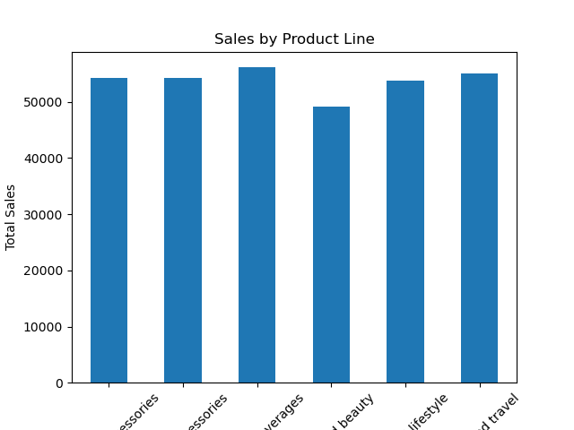
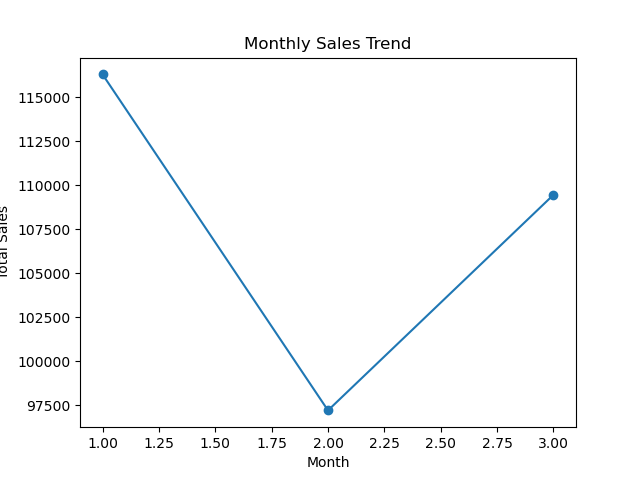
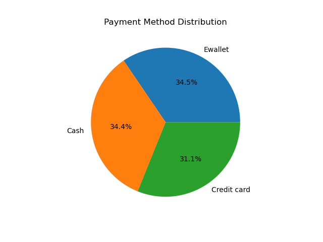

📊 Sales Data of Supermarkets Analysis

Objective

Perform analysis on the data to find out the performance of products, the trend of sales per month, and payment methods utilized.

Technologies

* Python
* Pandas
* Matplotlib

Structure of the Project

* data -> dataset
* notebook -> analysis code
* images -> visualizations

Visualizations

 📊 Sales by Product Line

📈 Sales Trend by Month

🥧 Popular Payment Methods

 Important Points Discussed

* Food & Beverages line sold the most
* Health & Beauty line sold the least
* Highest sales in Month 1
* Sales decrease in Month 2 but rise in Month 3
* The most popular payment method is e-wallet

 Conclusion

This project illustrates how data analysis can be leveraged for gaining insights about sales data and consumer behavior.

This project showcases how data analysis can provide valuable insights from sales data.